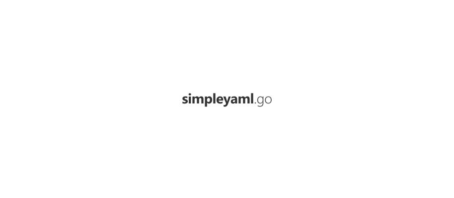

  
  
  
  
  
  

<a href="#ci-status">CI Status</a> • <a href="#license">License</a>

 

`go-simpleyaml` is a Go package to interact with arbitrary YAML, similar as [go-simplejson](https://github.com/bitly/go-simplejson).

### CI Status

| Branch | Status |
|--------|--------|
| `master` |  |
| `develop` |  |

### License

[Apache License, Version 2.0](https://www.apache.org/licenses/LICENSE-2.0)

